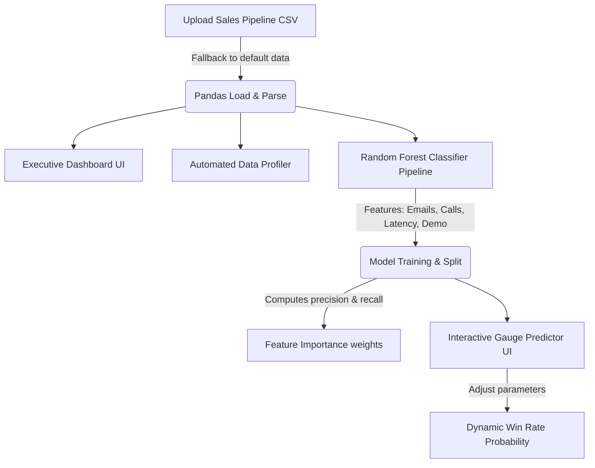

# 📊 Purpleash CSV Pipeline & Analytics Engine

[](https://opensource.org/licenses/MIT)
[](#)
[](#)
[](#)
[](#)

An enterprise-grade sales pipeline visualization dashboard and predictive machine learning tool. Purpleash enables users to upload sales CSV data, conduct automated data profiling, analyze deal size vs. response time latency, and utilize an embedded Random Forest classifier to predict lead conversion probabilities in real-time.

👉 **[Live Clickable Interactive Dashboard Demo](https://jawknee-builds.github.io/purpleash-csv/)**

---

## 🔮 Key Analytical Modules

- **Executive Analytics Dashboard**:
  - Glassmorphic KPI cards displaying: Total Active Pipeline Value, average Deal Size, Conversion Win Rate, and Average Outreach Latency.
  - Interactive Plotly charts: Pipeline Funnel stages, Lead Inflow by source channels, revenue-by-industry bar graphs, and deal size vs. latency scatter plots.
- **Automated Data Quality Profiler**:
  - Full file quality audit (row counts, column counts, missing cells, null percentages, duplicate records count).
  - Null percentage distributions bar charts.
  - Interactive **Pearson Correlation Matrix Grid Heatmap** for numeric outreach parameters.
- **Embedded ML Lead Predictor**:
  - Trains a dynamic **Random Forest Classifier** on the current active dataset.
  - Computes and displays validation metrics: Accuracy, Precision, and Recall in real-time.
  - Provides a dynamic feature importance horizontal bar chart indicating what drives lead conversions.
  - **Live interactive predictor**: Custom slider inputs for emails sent, calls made, response time, demo sessions, and proposals dispatched, rendering an interactive win-rate gauge (Hot, Warm, or Cold lead indicators) and prescriptive operational recommendations.
- **Lead Explorer**: Fully searchable data grid with advanced multiselect column filters (Stage, Industry, Deal Size Range) and a CSV exporter.

---

## 🛠️ Technology Stack & Libraries

- **Frontend framework**: [Streamlit](https://streamlit.io/) (enhanced using custom CSS injection for custom fonts, glowing borders, dark theme).
- **Visualization library**: [Plotly Express & Plotly Graph Objects](https://plotly.com/) (using custom purple/ash color scales).
- **Machine Learning**: [Scikit-learn](https://scikit-learn.org/) (`RandomForestClassifier`, train-test-split, metrics).
- **Core Processing**: Pandas, NumPy.

---

## 🏗️ Architecture & ML Pipeline



---

## 🚀 Running Locally & Quick Start

1. **Clone the repository**:
   ```bash
   git clone https://github.com/Jawknee-builds/purpleash-csv.git
   cd purpleash-csv
   ```

2. **Create a virtual environment & install dependencies**:
   ```bash
   python3 -m venv venv
   source venv/bin/activate
   pip install -r requirements.txt
   ```

3. **Start the Streamlit application**:
   ```bash
   streamlit run app.py
   ```
   Open your browser and navigate to `http://localhost:8501`.

---

## 🌩️ 100% Free Production Deployment

### 1. GitHub Pages (Primary - Instant & 100% Free)
1. Go to your **GitHub Repository Settings**.
2. Navigate to **Pages** in the left sidebar.
3. Select **Deploy from a branch**, set the branch to `main` (and directory to `/root`), and click **Save**.
4. Your beautiful, interactive glassmorphic dashboard will be live under your custom GitHub Pages domain instantly!

### 2. Streamlit Community Cloud (Alternative Python Server Hosting)
1. Sign in to [Streamlit Community Cloud](https://share.streamlit.io/).
2. Click **New app**, select `purpleash-csv` as your repository, set the branch to `main`, and the main file path to `app.py`.
3. Click **Deploy!**

---
*Created with 💜 by [Jawknee-builds](https://github.com/Jawknee-builds)*
